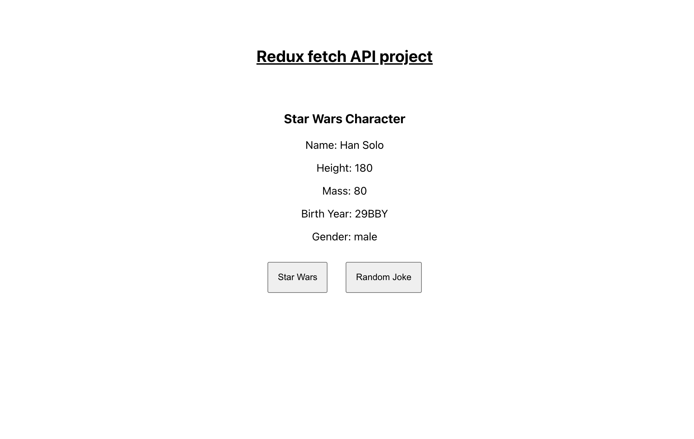

# REDUX FETCH API PROJECT

It is a redux based project. The libraries used are react-redux, redux, redux-thunk. This project is a demonstration of how redux works and how we can apply it in large projects.

## Table of contents

- [Overview](#overview)
  - [Screenshot](#screenshot)
  - [Links](#links)
- [My process](#my-process)
  - [Built with](#built-with)
  - [What I learned](#what-i-learned)
  - [Useful resources](#useful-resources)
- [Author](#author)
- [Acknowledgments](#acknowledgments)

## Overview

It is a simple Redux project to demonstrate the basic functionalities. We display star wars characters and a random joke using Redux in this project.

### Screenshot



### Links

- Live Site URL: [Live Website](https://kurosakicoder.github.io/ReduxBasic/)

## My process

First, I integrated Redux basic functionalities and then implemented JSX to display the redux state values

### Built with

- CSS
- Redux
- React JS

### What I learned

I learn how I can integrate Redux into big projects

```js
const s = useSelector((state) => state);
const dispatch = useDispatch();
```

### Useful resources

- [Scrimba](https://scrimba.com/learn/react)

## Author

- LinkedIn - [Khaidem Sandip Singha ](https://www.linkedin.com/in/khaidemsandip/)
- Twitter - [@KurosakiCoder](https://twitter.com/KurosakiCoder)

## Acknowledgments

I have done this project from scratch by referencing the websites that I mentioned.
